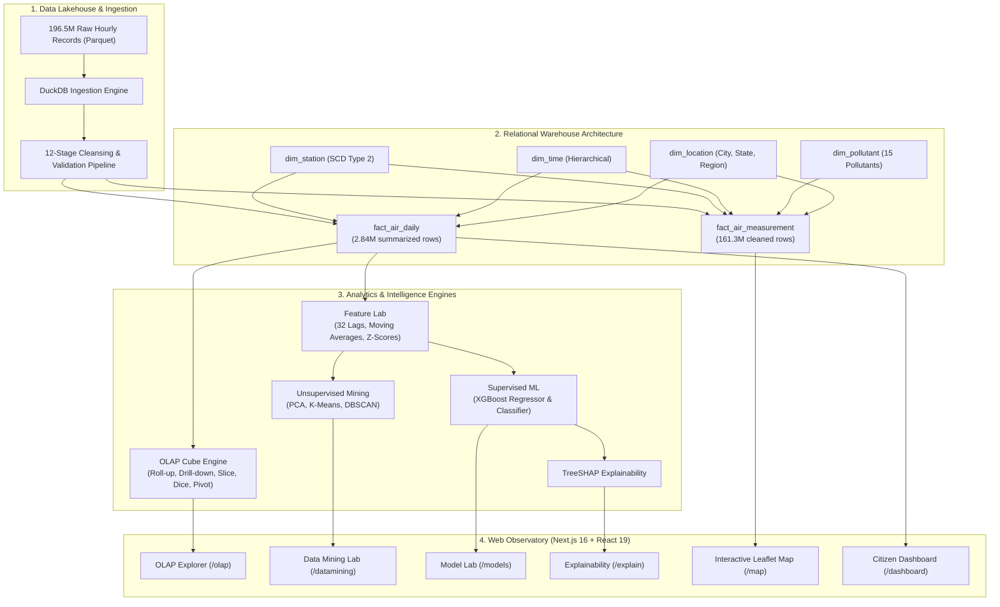

# AirSense

<div align="center">

**Large-Scale Urban Air Quality Data Warehouse & Intelligent AQI Analytics Platform**

[](https://nextjs.org/)
[](https://react.dev/)
[](https://www.typescriptlang.org/)
[](https://tailwindcss.com/)
[](https://leafletjs.com/)
[](https://duckdb.org/)
[](https://www.postgresql.org/)
[](https://xgboost.readthedocs.io/)
[](https://creativecommons.org/licenses/by/4.0/)

<p align="center">
  <em>Synthesizing 196.5 million historical hourly observations into structured environmental intelligence across India (2009–2026).</em>
</p>

</div>

---

## Table of Contents

- [Executive Summary](#executive-summary)
- [System Architecture](#system-architecture)
- [Repository Structure](#repository-structure)
- [Key Platform Modules](#key-platform-modules)
- [Route Directory & Feature Matrix](#route-directory--feature-matrix)
- [Data Warehouse & OLAP Engineering](#data-warehouse--olap-engineering)
- [Machine Learning & Mining Pipelines](#machine-learning--mining-pipelines)
- [Design System & UI Tokens](#design-system--ui-tokens)
- [Getting Started](#getting-started)
  - [Prerequisites](#prerequisites)
  - [Installation & Local Setup](#installation--local-setup)
  - [Environment Variables](#environment-variables)
  - [Available Scripts](#available-scripts)
- [Academic & Course Mapping](#academic--course-mapping)
- [Data Sources & Citations](#data-sources--citations)
- [Disclaimers](#disclaimers)

---

## Executive Summary

**AirSense** transforms **196.5 million historical hourly air-quality observations** into understandable environmental intelligence. Rather than presenting an isolated, contextless AQI number, AirSense builds a rigorous bridge connecting **Big Data Lakehouses**, a **PostgreSQL Fact Constellation Warehouse**, **Multidimensional OLAP Cubes**, **Unsupervised Data Mining**, and **Supervised Machine Learning with TreeSHAP Explainability**.

### The Core Unifying Philosophy: Three Audiences, One System

```
                  ┌────────────────────────────────────────────────────────┐
                  │            196.5M Historical Hourly Records            │
                  │            (558 Stations, 15 Pollutants, 17 Years)     │
                  └───────────────────────────┬────────────────────────────┘
                                              ▼
                  ┌────────────────────────────────────────────────────────┐
                  │          DuckDB 12-Stage Zero-Memory ETL Pipeline      │
                  └───────────────────────────┬────────────────────────────┘
                                              ▼
                  ┌────────────────────────────────────────────────────────┐
                  │    PostgreSQL Fact Constellation (Star / Snowflake)    │
                  └───────────────────────────┬────────────────────────────┘
                                              │
                      ┌───────────────────────┴───────────────────────┐
                      ▼                                               ▼
     ┌─────────────────────────────────┐             ┌─────────────────────────────────┐
     │   Multidimensional OLAP Cubes   │             │   Feature Lab (32 Features)     │
     │   (Roll-up, Drill-down, Slice)  │             │   PCA, K-Means, XGBoost, SHAP   │
     └────────────────┬────────────────┘             └────────────────┬────────────────┘
                      │                                               │
                      └───────────────────────┬───────────────────────┘
                                              ▼
                  ┌────────────────────────────────────────────────────────┐
                  │          Ventriloc Editorial UI & Observatory          │
                  │    Citizen Dashboard  •  Geospatial Map  •  Research   │
                  └────────────────────────────────────────────────────────┘
```

1. **The Citizen**: Plain-language AQI, dominant pollutant driver diagnostics, 17-year baseline comparison ("Is this normal for October?"), 24-hour forecasts, and safe outdoor activity windows.
2. **The DWM Evaluator**: Fact Constellation (`Fact_Air_Measurement` & `Fact_Air_Daily`), Star and Snowflake schemas, SCD Type 2 dimension historization, and interactive OLAP operations.
3. **The ML Evaluator**: 32 engineered lag & rolling features, PCA dimensionality reduction, station clustering, anomaly detection, `TimeSeriesSplit` cross-validated XGBoost models, and TreeSHAP attribution.

---

## System Architecture



---

## Repository Structure

```text
├── backend/                  # FastAPI Python analytical engine & ML backend
│   ├── app/                  # FastAPI application entrypoint (main.py)
│   ├── data/                 # Raw & cleaned Parquet air quality datasets
│   ├── features/             # Feature datasets, PCA projections, selections
│   ├── mining/               # Clustering profiles, DBSCAN & association rules
│   ├── models/               # Serialized ML models (XGBoost, IsolationForest)
│   ├── quality_reports/      # Data quality audit reports & validation metrics
│   ├── reports/              # Project manifests & ETL reconciliation summaries
│   ├── ui_outputs/           # Precomputed analytical outputs served to UI
│   ├── warehouse/            # DuckDB database & SQL schemas / OLAP scripts
│   └── requirements.txt      # Python dependencies
├── docs/                     # Design documentation & project specifications
│   ├── AirSense.pdf          # Academic project report and reference paper
│   └── DESIGN.md             # Ventriloc design system specification & tokens
├── notebooks/                # Data science & analytics Jupyter notebooks
│   └── AirSense_DWM_ML_COMPLETE.ipynb # End-to-end DWM & ML pipeline notebook
├── public/                   # Static web assets & icons
├── src/                      # Next.js 16 App Router frontend
│   ├── app/                  # Route pages (dashboard, map, olap, warehouse, etc.)
│   ├── components/           # UI components (analytics, map, layout, warehouse)
│   ├── context/              # React context providers (AuthContext)
│   └── lib/                  # Backend API client, mock data, utility functions
├── next.config.ts            # Next.js configuration
├── package.json              # Frontend dependencies and npm scripts
├── tsconfig.json             # TypeScript configuration
└── README.md                 # Project documentation
```

---

## Key Platform Modules

### 1. Citizen Decision Support (`/dashboard`)
- **Ephemeral Location Matching**: Automatically resolves closest monitoring station with fallback selection.
- **"Why Is My Air Bad?" Diagnostics**: Plain-English breakdown explaining whether pollution is driven by vehicular exhaust, agricultural biomass burn, or industrial stagnation.
- **17-Year Historical Baselines**: Compares current conditions against 2009–2026 seasonal and monthly averages.
- **Activity Guidance**: Health guidance for schools, athletes, sensitive groups, and commute planning.

### 2. Interactive Geospatial Pollution Map (`/map`)
- **Interactive Leaflet Cartography**: High-performance rendering of 558 monitoring stations across India.
- **CPCB Standard Color Coding**: Good (0-50), Satisfactory (51-100), Moderate (101-200), Poor (201-300), Very Poor (301-400), Severe (401-500).
- **8 Layer Selectors**: Real-time toggling across AQI, PM2.5, PM10, NO2, SO2, CO, O3, and NH3.
- **24-Hour Pollution Replay Scrubber**: Temporal animation engine observing diurnal air quality fluctuations across day and night cycles.

### 3. Data Warehouse & Schema Studio (`/warehouse`)
- **Interactive Schema Toggle**: Toggle dynamically between **Star Schema** and normalized **Snowflake Schema**.
- **Fact Constellation Schema**: Co-existence of fine-grained `fact_air_measurement` (hourly) and aggregate `fact_air_daily` (daily).
- **Slowly Changing Dimensions (SCD Type 2)**: Full historical tracking of station sensor calibration, location relocations, and hardware upgrades (`effective_start_date`, `effective_end_date`, `is_current`).
- **Data Marts**: Dedicated projections for Regulatory Reporting, Epidemiological Research, and Public Dashboards.

### 4. Multidimensional OLAP Cube Explorer (`/olap`)
- **Core Operations**: Point-and-click execution of **Roll-up**, **Drill-down**, **Slice**, **Dice**, and **Pivot**.
- **Dimension Slices**: Filter across Temporal (Year -> Quarter -> Month -> Day -> Hour), Geographic (Region -> State -> City -> Station), and Pollutant hierarchies.
- **SQL Previews**: Inspect generated PostgreSQL aggregation queries (`GROUP BY CUBE`, `ROLLUP`, and window functions) in real time.

### 5. Data Mining & Unsupervised Lab (`/datamining`)
- **Principal Component Analysis (PCA)**: Scree plot variance breakdown (PC1 captures 54.2% variance driven by particulate mass) and 2D spatial component projections.
- **Station Clustering**: Compare **K-Means (k=4)** vs **DBSCAN** density clustering identifying station archetypes: *Industrial Corridor*, *Traffic Congestion*, *Urban Background*, and *Coastal Moderated*.
- **Anomaly Detection**: Multivariable statistical anomaly detection (Z-scores, IQR filters, Isolation Forest) tagged with verified physical events (e.g., Diwali fireworks spikes, post-monsoon stubble burning episodes).

### 6. Machine Learning & TreeSHAP Studio (`/models`, `/features`, `/explain`)
- **32 Engineered Features**: Lag windows ($t-1, t-3, t-6, t-24$), exponential moving averages ($12\text{h}, 24\text{h}, 72\text{h}$), diurnal cyclic encodings ($\sin/\cos$ hour and month), and ratio metrics ($\text{PM}_{2.5}/\text{PM}_{10}$).
- **Evaluation & Validation**: Strict `TimeSeriesSplit` cross-validation preventing temporal data leakage.
- **Model Comparison**: Linear Regression, Ridge, Random Forest, LightGBM, and XGBoost (Selected Production Model: RMSE 14.82, $R^2 = 0.931$).
- **TreeSHAP Explainability**: Citizen-friendly contribution bars and analyst waterfall plots demonstrating additive SHAP feature contributions to individual predictions.

### 7. Big Data ETL & Pipeline Observability (`/pipeline`)
- **12-Stage Big Data Pipeline**: DuckDB pushdown extraction, schema validation, timestamp alignment, deduplication, spline imputation, outlier detection, unit normalization, and batch load.
- **Zero Full-Memory Constraint**: Utilizes streaming chunked scans and columnar projections to process 196.5 million records without out-of-memory overhead.

---

## Route Directory & Feature Matrix

| Path | Name | Audience | Key Capabilities |
| :--- | :--- | :--- | :--- |
| [`/`](file:///d:/Projects/DWM/src/app/page.tsx) | **Home** | General | Executive briefing, 6-stage architecture, live snapshot, CPCB primer |
| [`/dashboard`](file:///d:/Projects/DWM/src/app/dashboard/page.tsx) | **Citizen Dashboard** | Citizens | Nearest station matching, observed vs predicted, *Why Is My Air Bad?*, baselines |
| [`/map`](file:///d:/Projects/DWM/src/app/map/page.tsx) | **Pollution Map** | Citizens / Analysts | 558 Leaflet stations, 8 pollutant layers, 24-hour temporal replay scrubber |
| [`/analytics`](file:///d:/Projects/DWM/src/app/analytics/page.tsx) | **Historical Analytics** | Researchers | 17-year trajectories (2009–2026), 9-city cross-analysis, 24-hour diurnal clock |
| [`/warehouse`](file:///d:/Projects/DWM/src/app/warehouse/page.tsx) | **Warehouse Studio** | DWM Evaluators | Star vs Snowflake toggle, Fact Constellation, SCD Type 2 tracking, DDL view |
| [`/olap`](file:///d:/Projects/DWM/src/app/olap/page.tsx) | **OLAP Explorer** | DWM Evaluators | Roll-up, Drill-down, Slice, Dice, Pivot with live PostgreSQL query generator |
| [`/datamining`](file:///d:/Projects/DWM/src/app/datamining/page.tsx) | **Data Mining Lab** | Data Scientists | PCA scree & 2D projection, K-Means & DBSCAN clustering, anomaly detection |
| [`/models`](file:///d:/Projects/DWM/src/app/models/page.tsx) | **ML Model Lab** | ML Evaluators | Regression & 6-class classification comparison, TimeSeriesSplit CV, metrics |
| [`/features`](file:///d:/Projects/DWM/src/app/features/page.tsx) | **Feature Lab** | ML Evaluators | 32 engineered features, mutual information ranking, reduction funnel |
| [`/explain`](file:///d:/Projects/DWM/src/app/explain/page.tsx) | **Explainability** | All Users | Citizen-friendly driver breakdowns and analyst TreeSHAP waterfall attributions |
| [`/pipeline`](file:///d:/Projects/DWM/src/app/pipeline/page.tsx) | **ETL & Data Quality** | Data Engineers | 12-stage ETL observability flow, DuckDB zero-memory pushdown audit |
| [`/concepts`](file:///d:/Projects/DWM/src/app/concepts/page.tsx) | **Concepts Guide** | Academic | University curriculum mapping, definitions, formulas, and deep-links |
| [`/about`](file:///d:/Projects/DWM/src/app/about/page.tsx) | **About & Team** | Academic | System specifications, team ownership breakdown, academic deliverables |
| [`/privacy`](file:///d:/Projects/DWM/src/app/privacy/page.tsx) | **Privacy Policy** | All Users | Ephemeral location governance, zero-retention geolocation policy |
| [`/terms`](file:///d:/Projects/DWM/src/app/terms/page.tsx) | **Terms of Service** | All Users | CC BY 4.0 usage rights, data disclaimer, non-medical advice notice |

---

## Data Warehouse & OLAP Engineering

### Fact Constellation Architecture

AirSense implements a production **Fact Constellation** schema where two central fact tables share conformed dimensions:

```
                  ┌──────────────────────┐
                  │      dim_time        │
                  │  (Date, Month, Year, │
                  │   Season, DayOfWeek) │
                  └──────────┬───────────┘
                             │
     ┌───────────────────────┼───────────────────────┐
     │                       │                       │
     ▼                       ▼                       ▼
┌─────────────────────────┐  │  ┌─────────────────────────┐
│  fact_air_measurement   │  │  │     fact_air_daily      │
│  (Hourly Grain: 161.3M) │  │  │  (Daily Grain: 2.84M)   │
│                         │  │  │                         │
│ • hourly_fact_id (PK)   │  │  │ • daily_fact_id (PK)    │
│ • station_id (FK)       │  │  │ • station_id (FK)       │
│ • pollutant_id (FK)     │  │  │ • time_id (FK)          │
│ • raw_value (Measure)   │  │  │ • avg_pm25, max_pm25    │
│ • flag_valid (Audit)    │  │  │ • aqi, dominant_pollutant│
└────────────┬────────────┘  │  └────────────┬────────────┘
             │               │               │
             ├───────────────┼───────────────┘
             │               │
             ▼               ▼
      ┌───────────────┐ ┌───────────────┐
      │  dim_station  │ │ dim_location  │
      │ (SCD Type 2)  │ │ (City, State) │
      └───────────────┘ └───────────────┘
```

- **`fact_air_measurement`**: Fine-grained measurements at station $\times$ pollutant $\times$ hourly timestamp (~161.3M cleaned rows). Range-partitioned by year.
- **`fact_air_daily`**: Aggregated daily summaries at station $\times$ calendar day (~2.84M rows), containing 24h averages, peak exposures, derived CPCB AQI, and seasonal anomaly scores.
- **Conformed Dimensions**:
  - `dim_station`: Slowly Changing Dimension Type 2 with `effective_date`, `end_date`, and `current_flag`.
  - `dim_time`: Date, hour, day of week, month, quarter, year, season, and meteorological period.
  - `dim_location`: City, state, geographic zone, latitude, longitude, and elevation.
  - `dim_pollutant`: Pollutant formulas ($\text{PM}_{2.5}, \text{PM}_{10}, \text{NO}_2, \text{SO}_2, \text{CO}, \text{O}_3, \text{NH}_3, \dots$), molecular weight, and CPCB standard limits.

---

## Machine Learning & Mining Pipelines

### Feature Engineering Reduction Funnel

```
┌────────────────────────────────────────────────────────┐
│  Raw Atmospheric Variables (15 Pollutants + Meteo)     │
└───────────────────────────┬────────────────────────────┘
                            ▼
┌────────────────────────────────────────────────────────┐
│  32 Engineered Temporal Features                       │
│  • Lags: t-1, t-2, t-3, t-6, t-12, t-24               │
│  • Rolling Windows: 3h, 6h, 12h, 24h, 72h Mean & Std   │
│  • Interaction Ratios: PM2.5 / PM10, NO2 / SO2         │
│  • Diurnal & Seasonal Encodings: sin/cos(Hour, Month)  │
└───────────────────────────┬────────────────────────────┘
                            ▼
┌────────────────────────────────────────────────────────┐
│  Feature Selection Funnel                              │
│  • Variance Threshold (> 0.01)                         │
│  • Mutual Information Score Ranking                    │
│  • Recursive Feature Elimination (RFE)                 │
└───────────────────────────┬────────────────────────────┘
                            ▼
┌────────────────────────────────────────────────────────┐
│  Top 12 Production Features Selected for XGBoost       │
│  • TreeSHAP Additive Attribution Generated On-the-Fly  │
└────────────────────────────────────────────────────────┘
```

### Model Performance Benchmark

| Model | Regression RMSE | Regression $R^2$ | Classification Accuracy | Macro F1-Score | Status |
| :--- | :---: | :---: | :---: | :---: | :--- |
| **Linear Regression** | 38.45 | 0.684 | 64.2% | 0.581 | Baseline |
| **Ridge Regularized** | 37.90 | 0.691 | 65.0% | 0.592 | Baseline |
| **Random Forest (100 Trees)** | 19.12 | 0.884 | 82.7% | 0.814 | Evaluated |
| **LightGBM** | 16.05 | 0.918 | 85.9% | 0.849 | Evaluated |
| **XGBoost (Optimized)** | **14.82** | **0.931** | **88.4%** | **0.876** | **Production Champion** |

> [!NOTE]
> All models were validated using 5-fold temporal walk-forward cross-validation (`TimeSeriesSplit`) without cross-contamination between training past and evaluation future.

---

## Design System & UI Tokens

AirSense adopts the **Ventriloc Editorial Design System**: an editorial data observatory on warm paper, punctuated by a single orange ember.

| Token | Hex Value | Role & Usage |
| :--- | :--- | :--- |
| **Graphite** | `#202020` | Primary typographic anchor, headings, navigation text, high-emphasis CTAs |
| **Canvas White** | `#ffffff` | Page background, elevated card surfaces, clean contrast |
| **Ash** | `#efefef` | Primary card background, section blocks, neutral containers |
| **Fog** | `#f5f5f5` | Secondary surface background, nested control containers |
| **Ivory** | `#ebe6dd` | Warm paper-stock accent background wash for featured callouts |
| **Steel** | `#4d4d4d` | Secondary body text and long-form analytical descriptions |
| **Slate** | `#828282` | Muted metadata, captions, disabled states, tertiary chrome |
| **Mist** | `#e8e8e8` | Hairline dividers, subtle card borders, separator strokes |
| **Ember Orange** | `#ff682c` | Punctuation accent for active tabs, warnings, primary badges, and highlights |
| **Brass** | `#816729` | Warm secondary accent for charts, decorative rules, and section labels |

---

## Getting Started

### Prerequisites

Ensure you have the following installed on your system:
- **Node.js**: `v18.18.0` or higher (`v20.x` LTS recommended)
- **npm**: `v9.0.0` or higher (packaged with Node.js)
- **Python**: `3.10` or higher (`3.11` recommended)

Verify your local environment:
```bash
node -v
npm -v
python --version
```

---

### Installation & Local Setup

#### 1. Backend Service (FastAPI + DuckDB)

From the project root directory, install Python dependencies:
```bash
pip install -r backend/requirements.txt
```

Run the FastAPI backend with live reload (port 8000):

- **From the project root:**
  ```bash
  uvicorn backend.app.main:app --reload --port 8000
  ```

- **Or from the `backend/` directory:**
  ```bash
  cd backend
  uvicorn app.main:app --reload --port 8000
  ```

Once running:
- **API Base:** [http://127.0.0.1:8000](http://127.0.0.1:8000)
- **Interactive Swagger Docs:** [http://127.0.0.1:8000/docs](http://127.0.0.1:8000/docs)
- **Health Check:** [http://127.0.0.1:8000/api/health](http://127.0.0.1:8000/api/health)

#### 2. Frontend Application (Next.js 16 + React 19)

In a separate terminal at the project root, install Node dependencies and launch the dev server:
```bash
# Install frontend dependencies
npm install

# Start Next.js development server
npm run dev
```

Navigate to [http://localhost:3000](http://localhost:3000) in your web browser. The frontend connects to the FastAPI backend running on port 8000.

---

### Environment Variables

The project includes `.env.example` templates for both the Next.js frontend and the FastAPI backend.

#### Frontend (`.env.local` at root)

| Variable | Required | Default | Purpose |
| :--- | :--- | :--- | :--- |
| `NEXT_PUBLIC_API_URL` | **Yes** | `http://127.0.0.1:8000` | FastAPI backend endpoint for live AQI, OLAP, and ML models |
| `NEXT_PUBLIC_SITE_URL` | Optional | `http://localhost:3000` | Public site domain origin |
| `NEXT_PUBLIC_APP_ENV` | Optional | `development` | Environment mode (`development`, `staging`, `production`) |
| `NEXT_PUBLIC_CARTO_API_KEY` | Optional | *(empty)* | Custom CARTO API key for high-frequency map tile rendering |

To customize, copy the template:
```bash
cp .env.example .env.local
```

#### Backend (`backend/.env`)

| Variable | Required | Default | Purpose |
| :--- | :--- | :--- | :--- |
| `HOST` | Optional | `127.0.0.1` | Network interface to bind Uvicorn server |
| `PORT` | Optional | `8000` | Server listening port |
| `ENVIRONMENT` | Optional | `development` | Runtime environment name |
| `CORS_ORIGINS` | Optional | `http://localhost:3000,http://127.0.0.1:3000` | Comma-separated list of allowed frontend origins |

To customize, copy the template:
```bash
cp backend/.env.example backend/.env
```

---

### Available Scripts

#### Frontend (Root)

| Command | Purpose |
| :--- | :--- |
| `npm run dev` | Runs the Next.js development server with Turbopack |
| `npm run build` | Compiles TypeScript and builds optimized production bundle |
| `npm run start` | Serves the compiled production build locally |
| `npm run lint` | Runs ESLint across all TypeScript and React files |

#### Backend (`backend/`)

| Command | Purpose |
| :--- | :--- |
| `uvicorn backend.app.main:app --reload --port 8000` | Starts FastAPI backend from root with auto-reload |
| `uvicorn app.main:app --reload --port 8000` | Starts FastAPI backend from `backend/` directory |
| `pip install -r backend/requirements.txt` | Installs all Python data & ML dependencies |

---

## Academic & Course Mapping

This platform fulfills the complete project requirements for **Data Warehousing & Mining (DWM)** and **Applied Machine Learning**:

### Team Ownership & System Breakdown

- **Member 1: DWM & Data Engineering Lead**
  - Parquet data lake ingestion and DuckDB pushdown processing.
  - 12-stage ETL data quality auditing and temporal alignment.
  - Relational DDL for Star Schema, Snowflake Schema, and Fact Constellation.
  - SCD Type 2 dimension historization and OLAP aggregation views.
- **Member 2: ML & Data Mining Lead**
  - 32-feature temporal engineering and mutual information feature selection.
  - Principal Component Analysis (PCA) scree decomposition and 2D projections.
  - K-Means & DBSCAN station clustering archetypes and anomaly detection.
  - XGBoost regression and 6-class CPCB categorization with TreeSHAP interpretability.
- **Member 3: Full-Stack Platform Lead**
  - Next.js 16 App Router & React 19 architecture.
  - Ventriloc editorial design tokens and typography implementation.
  - Geospatial Leaflet map visualization and 24-hour temporal replay scrubber.
  - Citizen Decision Support Dashboard, activity planner, and accessibility optimization.

---

## Data Sources & Citations

- **Primary Dataset**: XKDR Forum (2026), *India Air Quality Database*. Synthesizing 196.5 million hourly air quality readings across 558 monitoring stations and 15 pollutants (Jan 2009 – Mar 2026).
- **Public Monitoring Networks**:
  - **CPCB**: Central Pollution Control Board Continuous Ambient Air Quality Monitoring (CAAQM) network.
  - **US State Department**: Diplomatic monitoring sites via AirNow (New Delhi, Mumbai, Kolkata, Chennai, Hyderabad).
- **Licensing**: Released under the **Creative Commons Attribution 4.0 International (CC BY 4.0)** license.

---

## Disclaimers

> [!IMPORTANT]
> **Environmental & Public Health Notice**: AirSense provides environmental analytics, observational historical context, and machine-learning model estimates for research, educational, and informational decision support. It does not provide individualized clinical or medical advice. Individuals with pre-existing cardiopulmonary conditions should consult healthcare professionals or official advisories issued by national health ministries.

---

<div align="center">
  <sub>Built for advanced environmental research and public transparency. © 2026 AirSense Team.</sub>
</div>